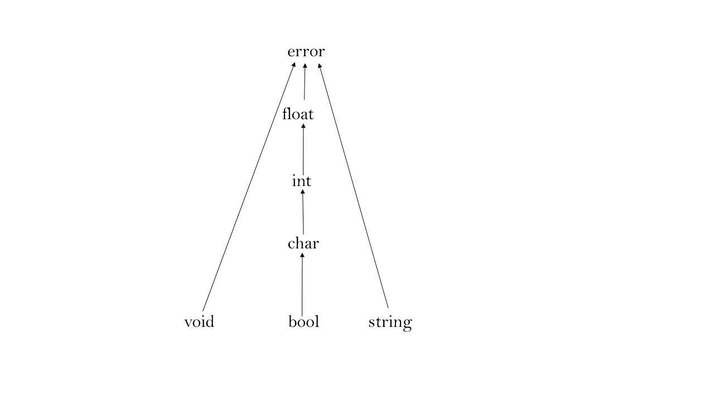

# ProgettoLC parte3 Gruppo 23-13 Relazione

Versioni degli strumenti usati:

BNFC - 2.9.5 | GHC - 9.8.2 | Happy - 2.0.2 | Alex - 3.5.1.0
Il codice viene compilato chiamando `make`. Oltre alla demo il cui risultato si può vedere con il comando `make demo`, nella cartella `tests` ci sono 14 file con alcuni nomi esplicativi che possono essere eseguiti chiamando `cabal repl main` e usando la funzione `testFile` seguita dal percorso del file.

La **grammatica** è stata implementata usando BNFC con l'opzione ```--functor```, che permette di generare un Abstract Syntax Tree costituito da tipi di dato con un parametro polimorfo. Ciò permette al parser di salvare la posizione (riga, colonna) dei Token comunicatigli dal Lexer. Ai file Alex e Happy generati da BNFC sono state apportate delle piccole modifiche per permettere il riconoscimento degli interi che rappresentano caratteri e per salvare l'informazione relativa alla posizione di dichiarazione dei parametri delle funzioni.

La grammatica generata contiene 3 **conflitti** shift/reduce. Negli stati 74 e 75 i conflitti vengono sciolti effettuando uno shift: fra le due scelte possibili questa è quella corretta, perché permette, nel caso in cui venga rilevato un carattere `[` di procedere con il riconoscimento di un accesso ad array. Anche il conflitto nello stato 193 viene risolto correttamente a favore dello shift.

Abbiamo deciso di costruire per la fase di analisi di semantica statica e per quella successiva di generazione del Three Address Code un AST polimorfo semplificato, la cui sintassi è specificata nel file ```AST.hs```. Il risultato della fase di parsing viene quindi trasformato tramite le procedure scritte nel file ```ASTBuilder.hs```. Il campo polimorfo serve a comunicare le informazioni necessarie fra una fase e la seguente. 

Per la **generazione di Three Address Code** abbiamo deciso di utilizzare uno stato costruito sulla base di una monade di stato e un "monad transformer" ```StateT s (m :: * -> *)``` (entrambi forniti dalla libreria ```Control.Monad.Trans.State```).

Lo stato comprende i seguenti elementi:
- un intero usato per generare gli identificatori dei temporanei e delle label
- un intero per i nomi dei puntatori alle stringhe salvate nell'area di memoria statica
- una lista di label usate per la generazionee del codice TAC
- una lista di istruzioni TAC (il codice TAC man mano generato)
- una lista di label sospese per un uso successivo (che permette l'uso della tecnica fall-through nella generazione di TAC per le espressioni booleane)
- una lista di coppie di label per permettere la gestione delle istruzioni di break e continue all'interno dei costrutti di iterazione
- una mappa che ha come chiavi i valori delle stringhe incontrate nel testo e come valore i nomi dei puntatori

Per gestire la definizione di **funzioni innestate** lo stato viene salvato e ripristinato grazie all'uso del "monad transformer". Più precisamente ad ogni dichiarazione di funzione innestata si salva in una pila l'attuale stato della funzione contenente quest'ultima. In seguito viene settato uno stato "empty" e si inizia ad aggiornarlo con le informazioni riguardanti la funzione innestata. Raggiunta la fine del body viene effettuato un pop dalla cima della pila, un merge dei 2 stati e settato lo stato risultante come "nuovo" stato.          

Negli assegnamenti la valutazione dell'l-value precede quella dell'r-value. La valutazione delle espressioni avviene da sinistra a destra, così come quella degli argomenti delle funzioni o procedure. La valutazione delle espressioni booleane avviene ovunque con modalità short-cut (guardie, passaggio dei parametri, assegnamenti).

Un **programma** nel linguaggio che abbiamo implementato non prevede un entrypoint esplicito (es. una funzione main), ma è costituito da un blocco, che si compone da una serie di istruzioni.

Il linguaggio **E** permette di usare i caratteri newline `\n` e `;` come separatori per le istruzioni. Essendoci entrambe le possibilità, abbiamo deciso di optare per la seconda, così da evitare di introdurre esplicitamente un token newline nel lexer, e evitare quindi l'inserimento di newline in maniera rigida nelle regole di produzione del parser. Abbiamo provato a introdurre la versione monadica di lexer e parser, in modo tale da attivare il riconoscimento dei newline solo in alcune circostanze, ma ciò introduceva un eccessivo numero di conflitti.

In qualsiasi punto all'interno dei blocchi è possibile **dichiarare** costanti, variabili e funzioni. Tutte le dichiarazioni prevedono la contemporanea inizializzazione. **Costanti e variabili** sono **visibili** solo dal punto di dichiarazione in poi, mentre le **dichiarazioni di funzioni** (e procedure) sono **visibili** in tutto il blocco. Come in `E` le procedure si dichiarano indicando il tipo di ritorno come `void`. In fase di analisi di semantica statica viene generato un errore nel caso in cui le funzioni/procedure dichiarate siano parziali. È possibile dichiarare funzioni/procedure ricorsive e anche mutuamente ricorsive, senza l'impiego di costrutti come prototipi o forward. Nelle procedure non è necessario scrivere l'istruzione di return `void` a fine blocco. 

Le **costanti** sono valori determinati al momento della compilazione e possono essere inizializzate con espressioni che comprendono altre costanti anche non precedentemente dichiarate.

Le **variabili** possono essere inizializzate con espressioni generiche. Variabili e costanti condividono lo stesso namespace, mentre le funzioni/procedure hanno un namespace separato. Le costanti devono essere scritte con caratteri maiuscoli (il caso contrario viene generato un warning). 

Nella seguente tabella elenchiamo gli operatori usati con la semantica consueta. L'operatore `&` è usato per l'operazione di referenziazione, il `$` per la dereferenziazione, il `@` per dichiarare riferimenti.

| Operatore | Precedenza  | Associatività   |
| :----:    |    :----:   |          :----: |
| \|\|      | 1           | Sinistra        |
| &&        | 2           | Sinistra        |
|!          | 3           |                 |
|==, !=, <, <=, >, >=| 4  |                 |
|+, - (binario)| 5        | Sinistra        |
|*, /, %    | 6           | Sinistra        |
|**         | 7           | Destra          |
|- (unario) | 8           |                 |
|++, -- (pre e post)| 9   |                 |
|&, $       | 10          |                 |

Per il **passaggio di parametri** le modalità ammesse sono per valore, per riferimento, per risultato e per valore-risultato. In caso la modalità non sia dichiarata nel programma, la modalità è per valore.

I casting impliciti sono ammessi solamente verso l'alto (secondo il reticolo dei tipi definito nella seguente sezione) e ogni tipo numerico ha una sintassi letterale associata.

Le uniche operazioni ammesse sul **tipo stringa** sono quelle di uguaglianza e disuaguaglianza. Nella generazione di TAC le stringhe vengono allocate in un'area di memoria statica come una sequenza contigua di caratteri terminati da `'\0'`. Occorrenze ripetute della stessa stringa nel codice sorgente verranno salvate una sola volta in quest'area di memoria. Nel codice TAC, identificati di tipo stringa vengono implementati con dei riferimenti a carattere che puntano all’inizio delle stringhe stesse. Il confronto fra stringhe avviene quindi con una chiamata runtime a una funzione predefinita `Fun_stringEq@(0,0`, il cui codice TAC viene inserito all'inizio del codice generato.

Gli **array** possono essere dichiarati con dimensioni esplicite oppure senza dimensioni, che vengono inferite dalla dichiarazione durante la fase di analisi di semantica statica. Le dimensioni, se specificate devono essere espressioni costanti compatibili con il tipo Int.  
Permettiamo l'inizializzazione per mezzo di array letterali. Non ci sono vincoli su quali espressioni sono ammesse nelle componenti dell'array letterale basta che abbiano un tipo supremum nel reticolo dei tipi che non sia error. Non consentiamo funzioni che ritornano tipi array e l'unico in cui si possono trovare array letterali è l'inizializzazione.
Possono essere inoltre dichiarati in modo **checked** per attivare il controllo a runtime sull'ammissibilità degli indici (tramite chiamata a una funzione `arrayOutOfBoundAcc_procedure` che assumiamo predefinita). Nel caso di array multidimensionali, la dichiarazione va ripetuta per ogni dimensione (es. ```var a1 :checked [2] checked [3] int := [[1,2,3],[4,5,6]];```). Nel caso in cui per una dimensione venga omessa la keyword **checked**, non verranno effettuati controlli a runtime su quella dimensione. La compatibilità fra gli array dipende dalle dimensioni e dalla presenza dell'indicazione checked: nel caso in cui due array abbiano la stessa forma, ma diverse dichiarazioni checked, non risultano compatibili.
Per quanto riguarda le operazioni consentite, permettiamo l'assegnamento (sia normale che composto) fra identificatori di tipo array, accessi ad array il cui tipo è ancora un array e tra dereference di identificatori il cui tipo è un puntatore ad array.    
Inoltre è stato implementato il passagio per valore,result,value-result anche per i vettori.

Per tutte le forme di **iterazione**, le due versioni determinate e quella indeterminata, è stata adottata la tecnica del fall-through, in modo da ottenere un numero minimo di salti. In quelle indeterminate è possibile usare le istruzioni di `break` e `continue`. L'uso di queste due istruzioni al di fuori dei costrutti di iterazione genera un errore. Nel costrutto determinato la variabile di iterazione rappresenta una dichiarazione implicita del corpo. Le espressioni che rappresentano il punto di partenza, l'incremento e il punto di arrivo vengono valutate una sola volta prima del ciclo.

Il meccanismo di **gestione delle eccezioni** è stato implementato in modo tale da riconoscere le istruzioni di
```throw``` solamente se dichiarate all'interno di un blocco ```try```. All'apertura di un tale blocco viene creata un'etichetta per permettere il salto incondizionato al blocco individuato dal ```catch``` nel caso in cui si trovi un'istruzione di ```throw```.

Sono possibili i commenti a singola linea e multilinea, questi non possono essere innestati.

# Type System

Le relazioni di compatibilità tra i tipi semplici previsti sono illustrate nell'immagine seguente:



*Il carattere `;` è usato come separatore fra istruzioni.*
Abbiamo usato `&` al posto del `@` per indicare il tipo puntatore. In genere, tutti i $\tau$ presenti nelle regole di tipo appartengono a $T_1$. CI sono alcune eccezioni, in quel caso è specificato.   

L'insieme dei tipi formali $\mathbb T_2$ è definito come segue:

$$
\begin{aligned}
\mathbb T_1=\{\bool,\char,\int,\float,\string\}\cup\{\&\tau\vert\tau\in\mathbb T_1\}\cup\{[n]\tau|n\in\mathbb N,\tau\in\mathbb{T_1}\}\\
\mathbb T_2=\mathbb{T_1}\cup\{\void\}\cup\{\mu_1\tau_1 \times \ldots \times \mu_n\;\tau_n \mapsto \tau\; |\tau \in \mathbb{T_1}\cup{void},\forall i (\mu_i\in\{byRef,byVal\}\;\wedge \; \tau_i\in \mathbb{T_1}) \}\\
\end{aligned}
$$

Introduciamo la relazione di **compatibilità** $\leq\:\subseteq\mathbb T_2\times\mathbb T_2$, dove $\tau_1\leq\tau_2$ denota che il tipo $\tau_1$ è compatibile con il tipo $\tau_2$. Inoltre, vale che:
* $\forall n\in\mathbb N\wedge\forall\tau_1,\tau_2\in\mathbb T_1.\; \neg([n]\tau_1\leq[n]\tau_2) \;\wedge\; \neg([n]\tau_2\leq[n]\tau_1) $.
* $\forall n\in\mathbb N \wedge\forall\tau\in\mathbb T_1. \; \neg([n]\tau\leq\&\tau) \;\wedge\; \neg(\&\tau\leq[n]\tau)$. 
* $\forall\tau\in\mathbb T_2.\;\tau\leq\tau$.
* $\forall n\in\mathbb N\wedge\forall\tau_1,\tau_2\in\mathbb T_1.\;\tau_1\leq\tau_2\longrightarrow\neg([n]\tau_1\leq[n]\tau_2) \wedge\neg(\&\tau_1\leq\&\tau_2)$.

L'insieme parzialmente ordinato $(\mathbb T_2,\leq)$ gode della [la proprietà del limite superiore]. La denotiamo con $\sup$ definito come segue:


$$
\tau_1\sup\tau_2=\begin{cases}
\tau_1 & \tau_1=\tau_2\\
\int & (\tau_1=\int\land\tau_2=\char)\lor(\tau_1=\char\land\tau_2=\int)\\
\int & (\tau_1=\int\land\tau_2=\bool)\lor(\tau_1=\bool\land\tau_2=\int)     \\ 
\float & (\tau_1=\float\land\tau_2=\char)\lor(\tau_1=\char\land\tau_2=\float)\\
\float & (\tau_1=\int\land\tau_2=\float)\lor
(\tau_1=\float\land\tau_2=\int)\\
\float & (\tau_1=\bool\land\tau_2=\float)\lor
(\tau_1=\float\land\tau_2=\bool)\\
\mathsf{error} & \mathrm{altrimenti}
\end{cases}
$$

## Dichiarazioni di variabile ($V$)

Dichiarazioni di variabile

$$
\frac{env\vdash_Ee:(\tau_2,\rvalue)\quad\tau_1\geq\tau_2}{\extenv,env\vdash_V|\mathtt{var}\;id\mathtt{:}\tau_1\;\mathtt{:=}\;e|:\{(id,\tau_1)\}}
$$

Sequenze

$$
\frac{env_2\vdash_Sstmt\quad \extenv,env_1\vdash_V\vdecl:env_3\quad env_2=\extenv\shdw env_1}{\extenv,env_1\vdash_V|stmt\;\mathtt{;}\;\vdecl|:env_3}
$$

$$
\frac{\extenv,env_1\vdash_V\vdecl:env_2\quad env_3\vdash_Sstmt\quad env_3=\extenv\shdw(env_1\clash env_2)}{\extenv,env_1\vdash_V|\vdecl\;\mathtt{;}\;stmt|:env_2}
$$

$$
\frac{\extenv,env_1\vdash_V\vdecl_1:env_2\quad \extenv,env_3\vdash_V\vdecl_2:env_4\quad env_3=env_1\clash env_2}{\extenv,env_1\vdash_V|\vdecl_1\;\mathtt{;}\;\vdecl_2|:env_2\clash env_4}
$$

$$
\frac{env_2\vdash_Sstmt\quad env_2=\extenv\shdw env_1}{\extenv,env_1\vdash_Vstmt:\varnothing}
$$

## Dichiarazione di funzioni ($F$)

Definiamo $\fonly{env}=\{(id,...\mapsto\tau):(id,...\mapsto\tau)\in env\}$ tale che $\fonly{env}$ contiene solo definizioni di funzioni. This lets us avoid full visibility for variable declarations.

Dichiarazione di funzione

$$
\begin{aligned}
&\tau=m^p_1\tau^p_1\times...\mapsto\tau^f\\
&\frac{env_2,env_3\vdash_Ff_{body}:env_{x}\quad env_2=\extenv\shdw env_1\quad env_3=\left\{(id^f,\tau),(\mathtt{return},\tau^f),(id_1^p,\tau^p_1),...\right\}}{\extenv,env_1\vdash_F|\mathtt{def}\;id^f\;\mathtt{(}m^p_1id^p_1\mathtt{:}\tau^p_1,\;...\mathtt{)}:\tau^f\;\{f^{body}\}|:\{(id^f,\tau)\}}
\end{aligned}
$$

Sequenze

$$
\frac{\extenv,env_5\vdash_V\vdecl:env_2\quad \extenv,env_3\vdash_F\fdecl:env_4\quad env_3=env_1\clash env_2\quad env_5=env_1\clash\fonly{env_4}}{\extenv,env_1\vdash_F|\vdecl\;\mathtt{;}\;\fdecl|:env_2\clash env_4}
$$

$$
\frac{\extenv,env_1\vdash_F\fdecl:env_2\quad \extenv,env_3\vdash_V\vdecl:env_4\quad env_3=env_1\clash env_2}{\extenv,env_1\vdash_F|\fdecl\;\mathtt{;}\;\vdecl|:env_2\clash env_4}
$$

$$
\frac{\extenv,env_4\vdash_F\fdecl_1:env_2\quad \extenv,env_3\vdash_F\fdecl_2:env_4\quad env_3=env_1\clash env_2\quad env_5=env_1\clash\fonly{env_4}}{\extenv,env_1\vdash_F|\fdecl_1\;\mathtt{;}\;\fdecl_2|:env_2\clash env_4}
$$

$$
\frac{\extenv,env_1\vdash_V\vdecl:env_2}{\extenv,env_1\vdash_F\vdecl:env_2}
$$

## Espressioni ($E$)

Identificatori

$$
\frac{env(id)=\tau\quad\tau\in\mathbb{T_2}}{env\vdash_E id:(\tau,\lvalue)}
$$

Accesso indicizzato

$$
\frac{env\vdash_Ee_1:(\mathsf{[n]}\tau_1,\omega)\quad env\vdash_Ee_2:(\tau_2,\rvalue)\quad\tau_2\leq\int,n\in\mathbb N, \omega\in\{\lvalue, \rvalue \} }{env\vdash_E|e_1\mathtt{[}e_2\mathtt{]}|:(\tau_1,\omega)}
$$


Letterali

$$
\frac{Type=\begin{cases}
\mathtt{bool}\mapsto\bool\\
\mathtt{char}\mapsto\char\\
\mathtt{integer}\mapsto\int\\
\mathtt{float}\mapsto\float\\
\mathtt{string}\mapsto\string
\end{cases}}{env\vdash_E\; literal:(Type(literal),\rvalue)}
$$

Array letterali

$$
\frac{\exist\tau\forall i(env\vdash_E e_i:(\tau_i,\rvalue)\;\wedge\; \tau_i\leq \tau\; \wedge \tau \not= error)}{env\vdash_E \mathtt{[}e_1 \ldots e_n\mathtt{]}:(\mathsf{[n]}\tau,\rvalue)}
$$

Operatori binari

$$
\frac{\mathtt{binaryMathOp}\in\{\mathtt{+},\mathtt{-},\mathtt{*},\mathtt{/},\mathtt{**}\}\quad env\vdash_Ee_1:(\tau_1,\rvalue)\quad env\vdash_Ee_2:(\tau_2,\rvalue)\quad(\tau_1\sup\tau_2)\leq\float}{env\vdash_E|e_1\;\mathtt{binaryOp}\;e_2|:(\tau_1\sup\tau_2,\rvalue)}
$$

$$
\frac{env\vdash_Ee_1:(\tau_1,\rvalue)\quad env\vdash_Ee_2:(\tau_2,\rvalue)\quad(\tau_1\sup\tau_2)\leq\int}{env\vdash_E|e_1\;\mathtt{\%}\;e_2|:(\tau_1\sup\tau_2,\rvalue)}
$$


$$
\frac{\mathtt{binaryOp}\in\{\mathtt{||},\mathtt{\&\&}\}\quad env\vdash_Ee_1:(\bool,\rvalue)\quad env\vdash_Ee_2:(\bool,\rvalue)}{env\vdash_E|e_1\;\mathtt{binaryOp}\;e_2|:(\bool,\rvalue)}
$$

Operatori unari

$$
\frac{\mathtt{unaryMathOP}\in\{\mathtt{++},\mathtt{--}\}\quad env\vdash_Ee:(\tau,\lvalue)\quad \tau\leq\float }{env\vdash_E\;\mathtt{unaryMathOP}\;e\;:(\tau,\rvalue)}
$$

$$
\frac{\mathtt{unaryMathOP}\in\{\mathtt{++},\mathtt{--}\}\quad env\vdash_Ee:(\tau,\lvalue)\quad \tau\leq\float }{env\vdash_E\;e\;\mathtt{unaryMathOP}\;:(\tau,\rvalue)}
$$

$$
\frac{env\vdash_Ee:(\bool,\rvalue)}{env\vdash_E\;\mathtt{!}e\;:(\bool,\rvalue)}
$$

$$
\frac{env\vdash_Ee:(\tau,\rvalue)\quad\tau\leq\float}{env\vdash_E\mathtt{-}e\;:(\tau\sup\int,\rvalue)}
$$

$$
\frac{env\vdash_Ee:(\tau,\lvalue)}{env\vdash_E\;\&e\;:(\&\tau,\rvalue)}
$$

$$
\frac{env\vdash_Ee:(\&\tau,\lvalue)}{env\vdash_E\;\$e\;:(\tau,\lvalue)}
$$

Operatori di confronto

$$
\frac{\mathtt{comparatorOp}\in\{\mathtt{==},\mathtt{!=},\mathtt{<},\mathtt{<=},\mathtt{>},\mathtt{>=}\}\quad env\vdash_Ee_1:(\tau_1,\rvalue)\quad env\vdash_Ee_2:(\tau_2,\rvalue)\quad(\tau_1\sup\tau_2)\leq\float}{env\vdash_E|e_1\;\mathtt{comparatorOp}\;e_2|:(\bool,\rvalue)}
$$

Chiamata di funzione

$$
\frac{env(id)=\mu_1\;\tau_1 \times \ldots \times \mu_n\;\tau_n \mapsto \tau \quad \tau\in T_2 \quad \forall i( (\mu_i = byRef \implies env\vdash_E e_i:(\tau_i',\lvalue) \wedge \tau_i' \sup \tau_i = \tau_i ) \wedge (\mu_i = byVal \implies env\vdash_E e_i:(\tau_i,\rvalue)) \wedge \tau_i' \sup \tau_i = \tau_i   ) }{env\vdash_E\;id(e_1 \ldots e_n):(\tau,\rvalue)}
$$

Valori

$$
\frac{env\vdash_Ee:(\tau,\lvalue)}{env\vdash_E e:(\tau,\rvalue)}
$$

## Comandi (statements) ($S$)

Blocco

$$
\frac{env,\varnothing\vdash_F\fdecl:env_x}{env\vdash_S\mathtt{\{}\fdecl\mathtt{\}}}
$$

Assegnamento

$$
\frac{env\vdash_Ee_1:(\tau_1,\lvalue)\quad env\vdash_Ee_2:(\tau_2,\rvalue)\quad\tau_1\geq\tau_2}{env\vdash_Se_1\;\mathtt{:=}\;e_2}
$$

$$
\frac{\mathtt{o}\in\{+,-,*,/,**,\&\&,|| \} \quad env\vdash_E e_1:(\tau_1,\lvalue)\quad env\vdash_Ee_2:(\tau_2,\rvalue)\quad\tau_1\geq\tau_2 }{env\vdash_Se_1\;\mathtt{o=}\;e_2}
$$

Condizionali

$$
\frac{env\vdash_E e:(bool,\rvalue)\quad env\vdash_S b}{env\vdash_S if\; e\;b}
$$

$$
\frac{env\vdash_E e:(bool,\rvalue)\quad env\vdash_S b_1 \quad env\vdash_S b_2}{env\vdash_S if\; e\;b_1\; b_2}
$$

$$
\frac{env\vdash_E e:(bool,\rvalue)\quad env\vdash_S b}{env\vdash_S while\; e\;b}
$$

Salti

$$
\frac{env(break) = void}{env\vdash_S break}
$$

$$
\frac{env(continue) = void}{env\vdash_S continue}
$$

$$
\frac{env(return)= \tau \quad env\vdash_E e : (\tau',\rvalue)\quad \tau' \leq \tau }{env\vdash_S return\; e }
$$


$$
\frac{env(return)= void}{env\vdash_S return\;}
$$
